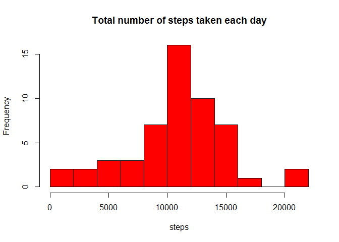
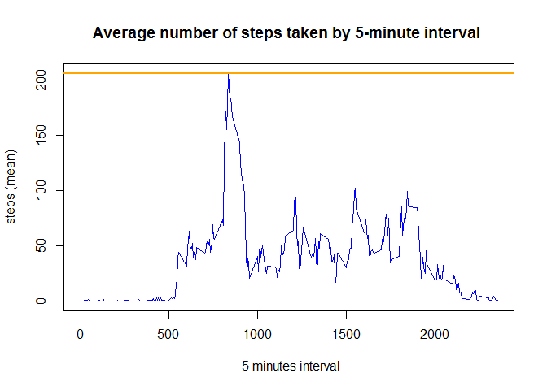
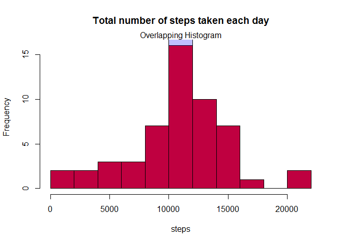
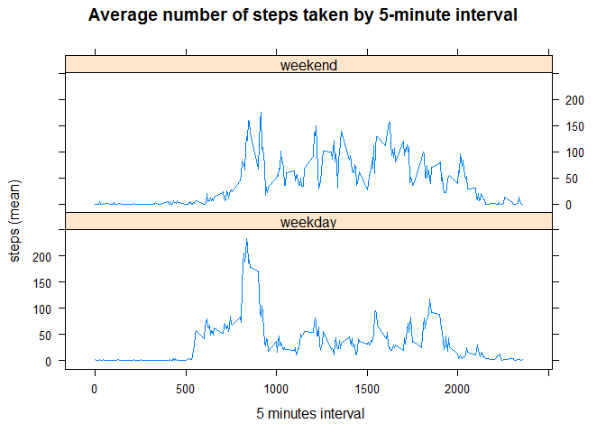

# **Reproducible Research**
## Course Project 1

### **Introduction**

It is now possible to collect a large amount of data about personal movement using activity monitoring devices such as a [Fitbit](http://www.fitbit.com/), [Nike Fuelband](http://www.nike.com/us/en_us/c/nikeplus-fuel), or [Jawbone Up](https://jawbone.com/up/app). These type of devices are part of the "quantified self" movement - a group of enthusiasts who take measurements about themselves regularly to improve their health, to find patterns in their behavior, or because they are tech geeks. But these data remain under-utilized both because the raw data are hard to obtain and there is a lack of statistical methods and software for processing and interpreting the data.

This assignment makes use of data from a personal activity monitoring device. This device collects data at 5 minute intervals through out the day. The data consists of two months of data from an anonymous individual collected during the months of October and November, 2012 and include the number of steps taken in 5 minute intervals each day.

### **Data**

The data for this assignment can be downloaded from the course web site:

Dataset: [Activity monitoring data](https://d396qusza40orc.cloudfront.net/repdata%2Fdata%2Factivity.zip) [52K]

The variables included in this dataset are:

**steps**: Number of steps taking in a 5-minute interval (missing values are coded as NA)  
**date**: The date on which the measurement was taken in YYYY-MM-DD format  
**interval**: Identifier for the 5-minute interval in which measurement was taken

The dataset is stored in a comma-separated-value (CSV) file and there are a total of 17,568 observations in this dataset.

### **Loading and preprocessing the data**

1. Load the data (i.e. read.csv())


```r
DownloadDirectory <- "Downloads"
if (!(file.exists(DownloadDirectory))) dir.create(DownloadDirectory)

## Set the working directory to the folder where the Project Downloads will be stored
entrywd<-getwd()
setwd(paste(entrywd,"/Downloads",sep=""))
if (!(file.exists("repdata-data-activity.zip"))){ 
    ## Downloads zip with data collected from Activity monitoring data
    activity.url="https://d396qusza40orc.cloudfront.net/repdata%2Fdata%2Factivity.zip"
    activity.zipFileName="repdata-data-activity.zip"
    download.file(
        url = activity.url,
        destfile = activity.zipFileName,
        mode = "wb")
    activity.downloadDate <- date()
    activity.downloadDate
    }
# Unzip the file on the working directory 
if (!(file.exists("activity.csv"))){
    activity.fileName <- unzip(zipfile = activity.zipFileName)}

# Read csv format file
activity <- read.csv("activity.csv", na.strings="NA")

# Back to initial working directory
setwd(entrywd)
```

2. Process/transform the data (if necessary) into a format suitable for your analysis. 


```r
# See basic characteristic from data
dim(activity)
```

```
## [1] 17568     3
```

```r
str(activity)
```

```
## 'data.frame':	17568 obs. of  3 variables:
##  $ steps   : int  NA NA NA NA NA NA NA NA NA NA ...
##  $ date    : Factor w/ 61 levels "2012-10-01","2012-10-02",..: 1 1 1 1 1 1 1 1 1 1 ...
##  $ interval: int  0 5 10 15 20 25 30 35 40 45 ...
```

```r
summary(activity)
```

```
##      steps                date          interval     
##  Min.   :  0.00   2012-10-01:  288   Min.   :   0.0  
##  1st Qu.:  0.00   2012-10-02:  288   1st Qu.: 588.8  
##  Median :  0.00   2012-10-03:  288   Median :1177.5  
##  Mean   : 37.38   2012-10-04:  288   Mean   :1177.5  
##  3rd Qu.: 12.00   2012-10-05:  288   3rd Qu.:1766.2  
##  Max.   :806.00   2012-10-06:  288   Max.   :2355.0  
##  NA's   :2304     (Other)   :15840
```

```r
# Look at the top and the bottom of data
head(activity)
```

```
##   steps       date interval
## 1    NA 2012-10-01        0
## 2    NA 2012-10-01        5
## 3    NA 2012-10-01       10
## 4    NA 2012-10-01       15
## 5    NA 2012-10-01       20
## 6    NA 2012-10-01       25
```

```r
tail(activity)
```

```
##       steps       date interval
## 17563    NA 2012-11-30     2330
## 17564    NA 2012-11-30     2335
## 17565    NA 2012-11-30     2340
## 17566    NA 2012-11-30     2345
## 17567    NA 2012-11-30     2350
## 17568    NA 2012-11-30     2355
```

```r
#transform the date field into a format suitable for your analysis
activity$date <- as.Date(activity$date)
```

### **What is mean total number of steps taken per day?**
#### For this part of the assignment, you can ignore the missing values in the dataset.

1. Make a histogram of the total number of steps taken each day.


```r
# Calculate the total number of steps taken per day
step.by.day <- aggregate(steps ~ date, data = activity, FUN = sum ,na.rm = FALSE)
head(step.by.day)
```

```
##         date steps
## 1 2012-10-02   126
## 2 2012-10-03 11352
## 3 2012-10-04 12116
## 4 2012-10-05 13294
## 5 2012-10-06 15420
## 6 2012-10-07 11015
```

```r
# Make a histogram of the total number of steps taken each day
hist(step.by.day$steps,breaks = 10, col='red',main = 'Total number of steps taken each day',xlab = 'steps')
```

 

2. Calculate and report the mean and median total number of steps taken per day.


```r
# mean and median of the total number of steps taken per day
mu <- format(mean(step.by.day$steps),digits = 8)
quantile50 <- format(median(step.by.day$steps),digits = 8)
```

The mean and median of the total number of steps by day are **10766.189** and **10765**, respectively.

### **What is the average daily activity pattern?**

1. Make a time series plot (i.e. type = "l") of the 5-minute interval (x-axis) # and the average number of steps taken, averaged across all days (y-axis).


```r
step.by.interval <- aggregate(steps ~ interval, data = activity, FUN = mean ,na.rm = FALSE)
head(step.by.interval)
```

```
##   interval     steps
## 1        0 1.7169811
## 2        5 0.3396226
## 3       10 0.1320755
## 4       15 0.1509434
## 5       20 0.0754717
## 6       25 2.0943396
```

```r
tail(step.by.interval)
```

```
##     interval     steps
## 283     2330 2.6037736
## 284     2335 4.6981132
## 285     2340 3.3018868
## 286     2345 0.6415094
## 287     2350 0.2264151
## 288     2355 1.0754717
```

```r
# Plot
with(step.by.interval,plot(interval,steps,type = 'l', col = 'blue', xlab = ' 5 minutes interval', ylab = 'steps (mean)', main = 'Average number of steps taken by 5-minute interval '))
abline(h = max(step.by.interval$steps), lwd = 3, col = 'orange')
```

 

2. Which 5-minute interval, on average across all the days in the dataset, contains the maximum number of steps?


```r
start.interval  <- step.by.interval[which.max(step.by.interval[,"steps"]),1]
end.interval <- start.interval + 5
maxstep <- format(max(step.by.interval$steps),digits = 3)
```

The 5 minutes interval from **835** to **840** contains the maximum number of steps equal to **206**.

### **Imputing missing values**

1. Calculate and report the total number of missing values in the dataset
i.e. the total number of rows with NAs.


```r
missing <- sum(is.na(activity$steps))
```

The dataset contain **2304** missing value. All of them correspond to column **steps**. 

2. Devise a strategy for filling in all of the missing values in the dataset. The strategy does not need to be sophisticated. For example, you could use the mean/median for that day, or the mean for that 5-minute interval, etc.

All of the missing values in the dataset were filled out with the mean for the 5-minute interval.

3. Create a new dataset that is equal to the original dataset but with the missing data filled in.


```r
newactivity <- activity
newactivity$steps[is.na(newactivity$steps)] <- step.by.interval$steps

# See basic characteristic from data
dim(newactivity)
```

```
## [1] 17568     3
```

```r
str(newactivity)
```

```
## 'data.frame':	17568 obs. of  3 variables:
##  $ steps   : num  1.717 0.3396 0.1321 0.1509 0.0755 ...
##  $ date    : Date, format: "2012-10-01" "2012-10-01" ...
##  $ interval: int  0 5 10 15 20 25 30 35 40 45 ...
```

```r
summary(newactivity)
```

```
##      steps             date               interval     
##  Min.   :  0.00   Min.   :2012-10-01   Min.   :   0.0  
##  1st Qu.:  0.00   1st Qu.:2012-10-16   1st Qu.: 588.8  
##  Median :  0.00   Median :2012-10-31   Median :1177.5  
##  Mean   : 37.38   Mean   :2012-10-31   Mean   :1177.5  
##  3rd Qu.: 27.00   3rd Qu.:2012-11-15   3rd Qu.:1766.2  
##  Max.   :806.00   Max.   :2012-11-30   Max.   :2355.0
```

```r
# Look at the top and the bottom of data
head(newactivity)
```

```
##       steps       date interval
## 1 1.7169811 2012-10-01        0
## 2 0.3396226 2012-10-01        5
## 3 0.1320755 2012-10-01       10
## 4 0.1509434 2012-10-01       15
## 5 0.0754717 2012-10-01       20
## 6 2.0943396 2012-10-01       25
```

```r
tail(newactivity)
```

```
##           steps       date interval
## 17563 2.6037736 2012-11-30     2330
## 17564 4.6981132 2012-11-30     2335
## 17565 3.3018868 2012-11-30     2340
## 17566 0.6415094 2012-11-30     2345
## 17567 0.2264151 2012-11-30     2350
## 17568 1.0754717 2012-11-30     2355
```

```r
# Calculate the total number of steps taken per day
new.step.by.day <- aggregate(steps ~ date, data = newactivity, FUN = sum ,na.rm = FALSE)
```

4. Make a histogram of the total number of steps taken each day and Calculate and report the mean and median total number of steps taken per day. Do these values differ from the estimates from the first part of the assignment? What is the impact of imputing missing data on the estimates of the total daily number of steps?


```r
hist(step.by.day$steps, breaks = 10, col = rgb(1,0,0,1),main = 'Total number of steps taken each day',xlab = 'steps')
hist(new.step.by.day$steps,breaks = 10,col=rgb(0,0,1,.25), add = TRUE)
mtext('Overlapping Histogram')
```

 

```r
# mean and median of the total number of steps taken per day
newmu <- format(mean(new.step.by.day$steps), digits = 8)
newquantile50 <- format(median(new.step.by.day$steps), digits = 8)
```

The mean and median of the total number of steps by day are **10766.189** and **10766.189**, respectively.  
The method chosen for imputing missing data, impacts slightly the median, but does not impact the mean.

### **Are there differences in activity patterns between weekdays and weekends?**

1. Create a new factor variable in the dataset with two levels -- "weekday" and "weekend" indicating whether a given date is a weekday or weekend day.


```r
activity$day.type <- weekdays.POSIXt(activity$date) %in% c("Saturday","Sunday")
activity$day.type <- factor(activity$day.type ,labels=c("weekday","weekend"))
step.by.interval <- aggregate(steps ~ interval + day.type, data = activity, FUN = mean)
```

2. Make a panel plot containing a time series plot (i.e. type = "l") of the 5-minute interval (x-axis) and the average number of steps taken, averaged across all weekday days or weekend days (y-axis).


```r
if (!'lattice' %in% installed.packages()) install.packages('lattice')
library(lattice)
xyplot(steps ~ interval | day.type, data = step.by.interval, type = 'l', layout = c(1, 2), xlab = ' 5 minutes interval', ylab = 'steps (mean)', main = 'Average number of steps taken by 5-minute interval')
```

 

As expected, steps through the weekend are distributed more evenly than weekday and there are activity later in the morning and later in the night.


